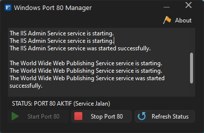

# 🚀 Windows Port 80 Manager

**Windows Port 80 Manager** adalah aplikasi Windows ringan yang dirancang untuk **mengelola Port 80 dengan mudah**, khususnya untuk menghentikan dan mengaktifkan kembali service IIS (Internet Information Services) hanya dengan **satu klik**.

Aplikasi ini sangat berguna bagi **web developer, programmer, dan system administrator** yang sering mengalami konflik Port 80 saat menjalankan Apache, XAMPP, atau web server lokal lainnya.

---

## ✨ Fitur Utama

* ✅ Start Port 80 (Mengaktifkan IIS Service)
* 🛑 Stop Port 80 (Menghentikan IIS Service)
* 🔄 Refresh Status Port 80 secara real-time
* 📋 Log aktivitas service yang jelas & informatif
* 🖥️ Antarmuka sederhana dan user-friendly
* ⚡ Tidak perlu membuka *Services.msc* secara manual

---

## 🧩 Service yang Dikelola

Aplikasi ini secara otomatis mengelola service berikut:

* **IIS Admin Service**
* **World Wide Web Publishing Service (W3SVC)**

---

## 🎯 Cocok Untuk

* Web Developer
* Programmer
* Pengguna XAMPP / Apache
* Administrator Sistem Windows
* Pengguna yang sering mengalami error **“Port 80 already in use”**

---

## 🖼️ Tampilan Aplikasi

> Contoh tampilan Windows Port 80 Manager:

---

## 🛠️ Cara Menggunakan

1. Jalankan aplikasi **Windows Port 80 Manager** sebagai **Administrator**
2. Cek status Port 80 pada bagian status
3. Klik:

   * **Stop Port 80** → untuk menghentikan service IIS
   * **Start Port 80** → untuk mengaktifkan kembali service IIS
4. Gunakan **Refresh Status** untuk memastikan kondisi terbaru

---

## ⚠️ Catatan Penting

* Aplikasi **wajib dijalankan sebagai Administrator**
* Hanya berfungsi pada sistem **Windows**
* Pastikan IIS sudah terinstal jika ingin menggunakan fitur Start Port 80

---

## 📦 Teknologi yang Digunakan

* Windows Service Management
* .NET / Windows API
* Desktop Application (Windows)

---

## 🔐 Keamanan

Aplikasi ini **tidak mengirim data ke internet** dan hanya bekerja secara lokal untuk mengelola service Windows.

---

## 🤝 Kontribusi

Kontribusi sangat terbuka!

1. Fork repository ini
2. Buat branch fitur (`feature/nama-fitur`)
3. Commit perubahan
4. Buat Pull Request

---

## 📄 Lisensi

Project ini menggunakan lisensi **MIT License**
Silakan digunakan, dimodifikasi, dan didistribusikan sesuai kebutuhan.

---

## 🙌 Penutup

Jika aplikasi ini membantu pekerjaan Anda, jangan lupa untuk ⭐ **star repository ini** agar semakin banyak orang terbantu.

Jika ada bug, saran, atau ide pengembangan, silakan buat **Issue** di repository ini.

---
